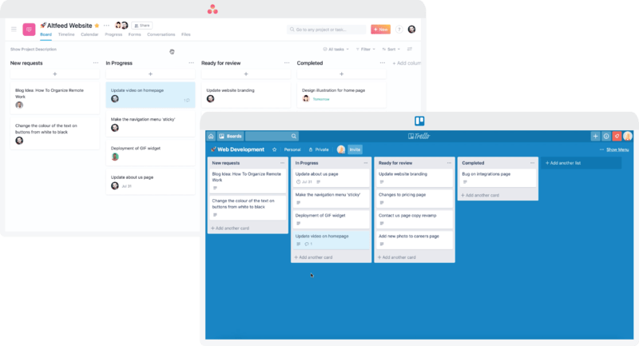

# Programa Adote um Calouro

## Sites Úteis

### Universidade Federal de Alagoas - UFAL
Site oficial da UFAL. Aqui você encontra informações sobre a UFAL como um todo, da graduação e tem acesso a vários documentos necessários para vários serviços dentro da universidade.
[Clique aqui](https://ufal.br/)

### Instituto de Computação - IC
Site oficial do IC. Aqui você encontra informações sobre o curso (CC ou EC), documentos importantes como o projeto pedagógico do curso, ementa das disciplinas, contato dos professores, etc...
[Clique aqui](https://ic.ufal.br/pt-br)

### Diretório Acadêmico de Computação - DIACOM
Aqui você encotra uma série de informações e recursos para te auxiliar no início da vida acadêmica. Vale a pena dar uma conferida com calma no conteúdo.
[Clique aqui](https://sites.google.com/ic.ufal.br/diacom/Diacom)

### The Huxley
Para praticar programação resolvendo problemas. Dá para filtrar as questões por nível, nome e assunto. Aconselho treinar muito nessa plataforma.
[Clique aqui](https://www.thehuxley.com/)

### C Plus Plus
Para consultar a referência da linguagem C/C++. Aqui dá pra pesquisar as bibliotecas disponíveis e toda a documentação das funções de cada biblioteca (inglês)
[Clique aqui](https://cplusplus.com/)

### Visualgo
Para ver graficamente a execução e construção de alguns algorítimos e estruturas de dados. Ajuda muito no entendimento do funcionamento das estruturas.
[Clique aqui](https://visualgo.net/en)

### Hastebin
Site para compartilhar trechos de código. Muitas vezes precisamos mostrar um trecho de código para alguém remotamente mas, fazer isso pelo _Whatsapp_, _Telegram_, etc fica bem complicado. No **Hastebin** você pode escrever seu trecho de código de forma simples, o site destaca as palavras chave da liguagem com cores, formata o código com fonte mono espaçada e, depois de salvo, você pode compartilhar a URL com qualquer pessoa. Seu código fica online por **7 dias**.
[Clique aqui](https://hastebin.com/)

### Pastebin
O Pastebin também permite compartilhar trechos de código mas, diferente do Hastebin, ele tabém permite que o usuário crie uma conta e armazene seus códigos por mais tempo. Assim, você pode usá-lo como um repositório de código pessoal.
[Clique aqui](https://pastebin.com/)

### Codeshare
O Codeshare é uma plataforma onde você pode codar em tempo real com outras pessoas. É uma ótima ferramenta para projetos em equipe onde vários integrantes podem trabalhar simultaneamente no mesmo código e ver as alterações acontecendo em tempo real.
[Clique aqui](https://codeshare.io/)

## Livros

## Canais no YouTube 

### eXcript
Playlist de linguagem C
[Clique aqui](https://www.youtube.com/playlist?list=PLesCEcYj003SwVdufCQM5FIbrOd0GG1M4)

### Programação Descomplicada
Playlist Linguagem C Descomplicada
[Clique aqui](https://www.youtube.com/playlist?list=PL8iN9FQ7_jt4DJbeQqv--jpTy-2gTA3Cp)

## Dicas

### Inglês
Recomendo ir estudando o quanto antes. Além de ser um diferencial para as vagas nas empresas, vai te possibilitar ter acesso à muito mais conteúdo de estudo e informações sobre qualquer coisa.

O [Duolingo](https://pt.duolingo.com/) é um site/app que você pode usar para ir estudando aos poucos e de forma gratuita. Tem a versão paga também mas a versão free já ajuda bastante.

### Git e GitHub

Assim que possível, aprenda a usar essas duas ferramentas:

* **Git**: ferramenta para versionamento de código. 
* **GitHub**: site onde você pode armazenar seus repositórios Git na nuvem, além de poder ter acesso aos repositórios de outros usuários, criar organizações, colaborar com projetos, etc...

Tanto o Git como o GitHub fazem parte da vida do programador. Logo logo você será obrigado a fazer alguma coisa envolvendo uma delas ou as duas. Então melhor se antecipar. :]

### Trello

O [Trello](https://trello.com/home) é uma plataforma onde você pode organizar os seus projetos criando quadros e cards. Você pode usá-lo para controlar as suas atividades do semestre, as tarefas de algum projeto que esteja participando, coordenar as atividades dos membros da sua equipe, etc... Ajuda muito na organização das suas atividades.

### Guarde seus códigos

À medida que vamos estudando, nos deparamos com vários tipos de problema diferentes para os quais implementamos as devidas soluções. É bem provável que esses problemas se repitam e, para que não seja preciso implementar toda a solução novamente, é interessante manter nossos códigos guardados em algum lugar para que possamos resgatá-los quando precisarmos. A ideia é fazer uma espécie de biblioteca de código pessoal para posteriores consultas.

Ex: Suponha que você precisa resolver um problema de ordenar uma lista de valores. Você implementa a solução e tem sua lista ordenada. Suponha agora que dias depois você precisa implementar o ranking de uma competição. Você precisará novamente ordenar uma lista de valores, correto? Se você guardou o seu código que resolve esse problema, não precisará implementar novamente algo que já fez.

Onde você pode armazenar seus códigos: GitHub, Pastebin, Google Drive, etc...