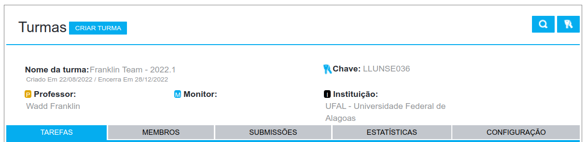

# Listas de Exercícios

Aqui serão avaliadas as pontuações nas listas de exercícios.

São **3 listas** sendo as duas primeiras compostas por **15 questões** cada e a terceira com **20 questões**.

Cada questão vale **1 ponto**.

A pontuação será calculada através do **somatório dos pontos** onde cada lista terá um peso.