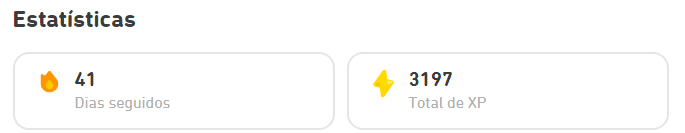

# Pontuação no Duolingo

Aqui serão avaliados dois critérios do App **Duolingo**: a **ofensiva** e o **XP total**.

## Ofensiva

A ofensiva representa a quantidade de dias seguidos que você pontuou no app. Basta fazer qualquer atividade para pontuar e conseguir a ofensiva daquele dia.

## XP Total

Somatório de todo o XP acumulado das atividades feitas no app. Existem vários tipos de atividade onde é possível ganhar XP.

## Pontuação Final

Será o somatório do **total de XP acrescido de uma porcentagem relacionada com a ofensiva**, ou seja, a ofensiva atua como um **fator multiplicador** do XP Total.