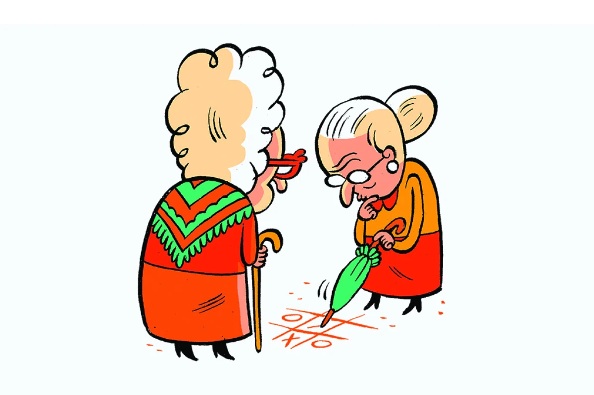

# Projeto Final - Jogo da Velha

O projeto final consiste em desenvolver um **jogo da velha**. O jogo deverá conter as seguintes funcionalidades:

## Tela Inicial
O jogo deverá implementar uma tela inicial para que o jogador selecione as opções

## P1 x CPU
O jogo deverá implementar a opção de um humano jogar contra o computador

## P1 x P2

O jogo deverá implementar a opção de um humano jogar contra outro humano

## Menu de Instruções

O jogo deverá implementar a opção de instruções para informar ao jogador sobre as regras do jogo e como jogar

## Pontuação

A pontuação final do projeto será o **somatório** de cada um dos requisitos do jogo e um requisito técnico que é usar as estruturas aprendidas durante o curso: **função, array, matriz, structs,** etc...

Cada requisito vale **10 pontos**.