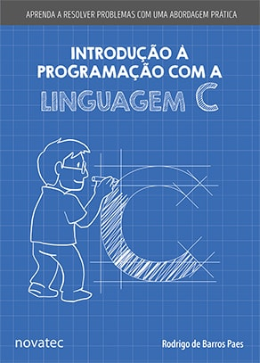

## Exemplo 1: Fatorial

## Exemplo 2: Decimal para binário

## Exemplo 3: Fibonacci

## Exemplo 4: Soma dos números em um array

### Exercícios:

* **Ex1:** Reproduza o programa do exemplo 4 modicicando-o para que a soma seja feita de trás para a frente, ou seja, do último elemento para o primeiro.
* **Ex2:** Faça uma função recursiva que encontre um determinado número no array e retorne o índice de onde ele foi encontrado. A função deve ter a seguinte assinatura: ```int procurar(int *a, int tam, int indice)```
* **Ex3:** Faça uma função recursiva que receba um array como parâmetro e retorne o seu maior elemento: ```int maior(int *a, int tam, int indice)```

## Exemplo 5: Palíndromo

# Referência:

Livro: Introdução à programação com a linguagem C

